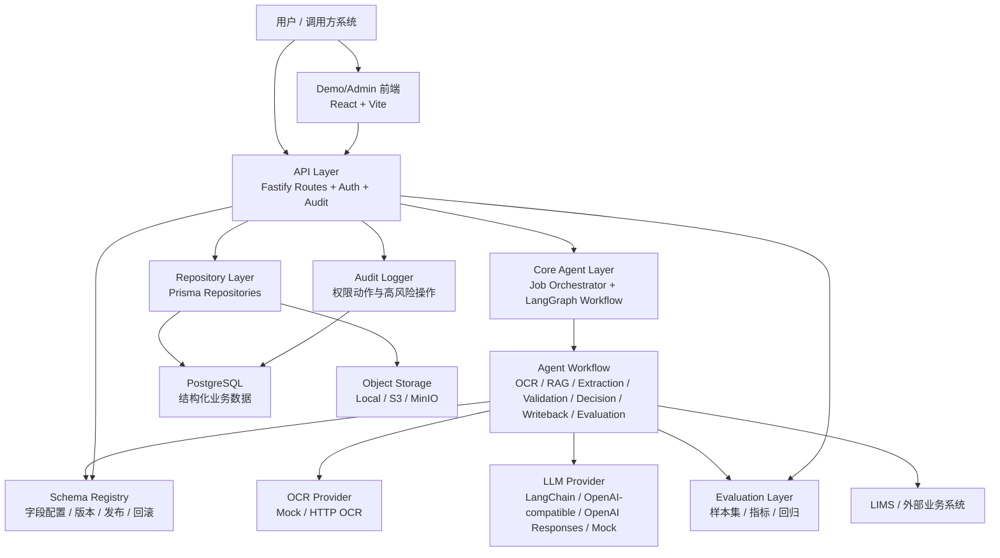
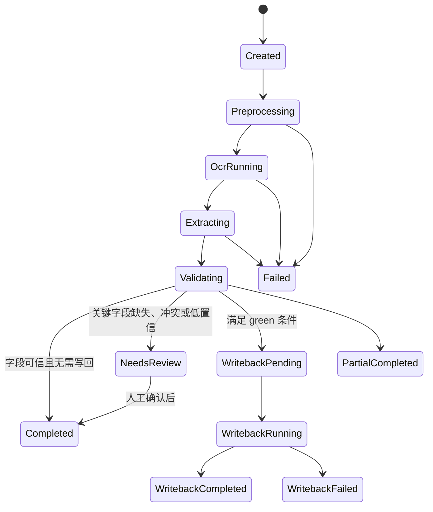
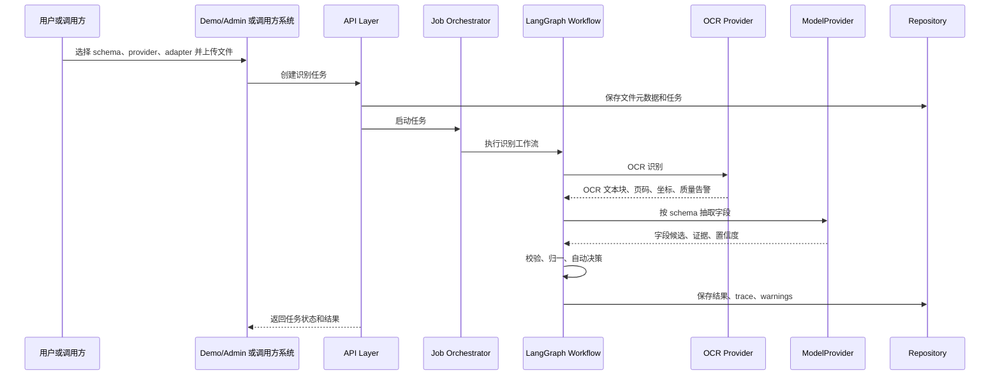
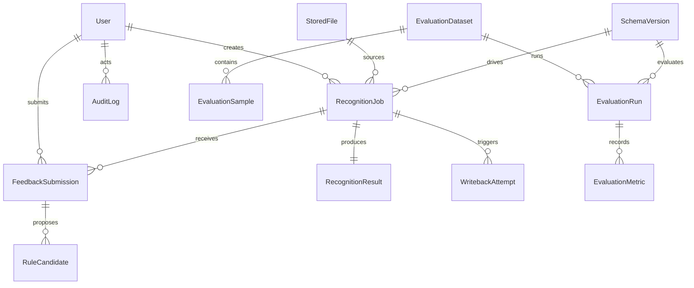
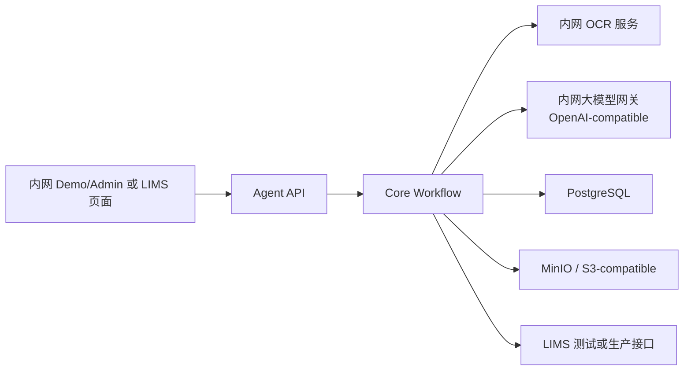

# 病历识别 Agent 系统架构文档

## 1. 文档定位与目标

本文档描述“病历识别 Agent”的目标系统架构，内容基于 `docs/superpowers/specs/2026-06-04-medical-record-recognition-agent-design.md` 和 `docs/superpowers/plans/2026-06-04-medical-record-agent-product.md` 汇总整理。

本文档不以当前代码完成度为主线，也不做阶段验收清单。它面向方案评审、研发交接和后续扩展，重点说明系统为什么这样拆分、核心链路如何流转、关键数据如何治理、技术栈为什么这样选择，以及生产化时需要遵守的安全和审计边界。

系统目标是构建一个基于 TypeScript 的通用病历识别 Agent 服务。它能够接收病历图片、PDF、扫描件或已有 OCR 文本，输出结构化字段候选结果、字段证据、置信度、质量告警和可选业务系统 payload。LIMS 临床信息字段是第一套默认业务 preset，但系统本身不绑定 LIMS，后续可以扩展到其他病历结构化、质控、评估和业务写回场景。

## 2. 业务背景与系统范围

病历识别 Agent 解决的是“非结构化医疗文档到结构化业务字段”的问题。传统 OCR 只能给出文本，无法稳定回答字段含义、证据来源、字段冲突、业务枚举归一和写回风险；单纯使用大模型又容易缺少可追溯证据、版本治理和生产安全控制。因此系统采用 OCR、LLM、规则校验、RAG、工作流和审计治理组合的架构。

目标范围包括：

- 病历文件接收、预处理、OCR、文本块归并和文档质量告警。
- 基于字段 Schema 的结构化字段抽取、证据定位、置信度输出和字段归一。
- 基于 LangGraph 的识别工作流编排，包括 OCR、RAG、抽取、校验、自动决策、写回和评估节点。
- Schema 在线编辑、校验、发布、停用、回滚和版本对比。
- Provider 插件化接入，包括真实 OCR、真实 LLM、OpenAI-compatible 模型网关、OpenAI Responses 实验通道、对象存储和 LIMS 写回。
- 生产级用户登录、角色权限、API token、审计日志和敏感操作控制。
- LIMS 临床信息 payload 生成和受控写回，支持高置信自动写回与人工确认后写回。
- 人工反馈沉淀为评估样本、规则候选和后续 schema/prompt 优化依据。
- 真实脱敏样本评估、字段级指标、证据覆盖率、低置信召回率和版本回归。
- Demo/Admin 前端，用于测试、演示、配置、运维、评估和写回控制。

非目标包括：

- 不做无规则静默写回。任何 LIMS 写回都必须经过权限、幂等、自动决策和审计控制。
- 不把 Demo/Admin 前端直接替代 LIMS 正式业务页面。它可以承载演示、测试和管理，也可以模拟人工确认，但生产确认可以由 LIMS 或其他调用方系统承载。
- 不把真实病历原文无控制地发送到公网 provider。公网 provider 只能通过显式配置启用，并配合脱敏策略、审计和访问控制。
- 不绑定单一 OCR、LLM 或存储厂商。Provider 必须以可替换接口接入。
- 不把人工反馈直接发布到生产 schema 或 prompt。反馈只能先形成候选样本或规则建议，发布必须经过人工审核。

## 3. 技术栈选型

### 3.1 总体技术栈

| 层级 | 技术栈 | 作用 |
| --- | --- | --- |
| 工程组织 | TypeScript、pnpm workspace | 统一前端、后端、核心引擎和共享类型，降低跨层字段合同漂移 |
| API 服务 | Fastify、Zod、JWT、bcryptjs | 提供轻量高性能 API、参数校验、登录认证和密码安全 |
| 数据访问 | Prisma、PostgreSQL | 管理任务、结果、Schema、反馈、评估、用户、权限、审计和写回记录 |
| 文件存储 | 本地文件存储、S3/MinIO compatible Storage、AWS SDK S3 Client | 存储原始病历、拆页图片、OCR 中间产物、评估文件和下载对象 |
| Agent 工作流 | LangGraph.js | 表达 OCR、RAG、抽取、校验、自动决策、写回、评估等状态节点和条件分支 |
| LLM 编排 | LangChain.js | 管理 prompt template、structured output、tool 封装和轻量 RAG 调用 |
| 模型 Provider | OpenAI SDK、OpenAI-compatible HTTP Provider、MockModelProvider | 支持公网模型、内网模型网关、OpenAI Responses 实验和稳定测试 |
| OCR Provider | MockOcrProvider、HTTP OCR Provider | 支持确定性测试和真实 OCR 服务接入 |
| 前端 | React、Vite、React Router、TanStack Query、lucide-react、driver.js | 构建 Demo/Admin 管理台、任务页、Schema Studio、评估页和引导流程 |
| 测试 | Vitest、pg-mem、临时文件目录 | 覆盖核心逻辑、Provider、Repository、API 和评估指标 |

### 3.2 选择 TypeScript 和 pnpm workspace 的原因

系统需要同时维护字段 Schema、识别结果、证据、payload、反馈、评估样本和审计事件。若前后端、核心引擎和 API 各自定义数据结构，很容易出现字段 key 不一致、状态枚举不一致、payload 映射漂移等问题。

TypeScript 让核心类型可以沉淀在 `packages/shared` 中，由 `packages/core`、`apps/api` 和 `apps/demo-web` 共同引用。pnpm workspace 让这些包在同一仓库内按边界演进，既能复用类型，又能避免把前端展示逻辑混入识别引擎。

选择 monorepo 的主要原因是：

- 字段合同需要跨前端、API、核心引擎和测试共享。
- Agent 工作流、业务 payload、Schema Studio 和评估体系需要同步演进。
- Demo/Admin 前端和 API 都服务于同一个产品闭环，独立仓库会增加版本协调成本。
- workspace 可以保留包边界，避免变成无边界单体。

### 3.3 选择 Fastify 的原因

Fastify 适合承载插件化 API 服务。系统存在 Auth API、Schema API、Job API、File API、Result API、Feedback API、Provider API、Writeback API、Evaluation API 和 Audit API，这些路由组具有清晰边界，适合通过模块化注册。

Fastify 的优势包括：

- 路由注册和插件模型清晰，便于按领域拆分 route modules。
- 性能和启动速度适合任务型服务和 Demo/Admin 管理台。
- 与 TypeScript 配合较好，方便为路由依赖注入 service/repository。
- 中间件和 hook 适合统一接入鉴权、权限检查、审计和错误处理。

### 3.4 选择 Prisma 和 PostgreSQL 的原因

病历识别 Agent 不只是临时任务队列，还需要长期保存可审计的数据资产，包括 Schema 版本、识别结果、人工反馈、规则候选、评估运行、写回尝试和审计日志。这类数据关系明确、查询维度多、需要事务和索引，适合使用 PostgreSQL。

Prisma 的价值在于：

- 用 schema 明确数据模型和关系，降低数据库结构隐式漂移。
- 自动生成类型安全的 client，减少 repository 层手写 SQL 错误。
- 迁移文件能记录数据模型演进，便于生产部署和回滚审查。
- 与 TypeScript 工程天然适配。

PostgreSQL 适合保存结构化业务数据；原始病历文件、拆页图片和较大的中间产物则应放在本地文件存储或 S3/MinIO 兼容对象存储中，数据库只保存对象 key、checksum、权限和生命周期元数据。

### 3.5 选择 LangGraph.js 的原因

病历识别不是一次简单的“把 OCR 文本丢给模型”调用，而是一条带状态、分支和失败路径的工作流：

1. 文件预处理。
2. OCR 调用。
3. 轻量 RAG 检索。
4. 字段抽取。
5. 字段校验和归一。
6. 自动决策。
7. 可选写回。
8. 评估样本沉淀。

LangGraph.js 适合表达这种状态机式 Agent 工作流。它比自由对话式 Agent 更可控，能够明确每个节点的输入、输出、状态转移和失败路径。医疗场景不能依赖不可控的自由 Agent 自行决定是否写回，因此 LangGraph 被放在主链路。

### 3.6 选择 LangChain.js 的原因

LangChain.js 用于模型调用层和轻量 RAG 组合，重点承担 prompt template、structured output、tool 封装和 retriever 接入。它不负责定义业务状态机，状态机由 LangGraph 承载。

这种分工的原因是：

- LangChain 适合封装模型调用、结构化输出和检索上下文。
- LangGraph 适合表达跨节点流程和条件分支。
- 二者都在 TypeScript 生态内，便于和 `packages/core` 集成。
- 后续可以把 ModelProvider 切换到 OpenAI-compatible 网关或 OpenAI Responses，而不破坏工作流接口。

### 3.7 选择 OpenAI Responses 和 OpenAI-compatible Provider 的原因

系统需要同时支持公网原型、内网私有化和模型能力实验。OpenAI-compatible HTTP Provider 适合接入内网大模型网关或兼容 OpenAI 协议的厂商服务；OpenAI Responses Provider 适合验证结构化输出、工具调用、tracing 和新模型能力。

目标架构中将 OpenAI Responses 放在实验与真实 provider 的可选实现位置，而不是唯一主线。这样既能学习和验证新能力，又不会让生产系统绑定单一公网服务。

### 3.8 选择 React、Vite 和 TanStack Query 的原因

Demo/Admin 前端不是营销页面，而是面向识别、配置、评估和运维的工作台。它需要多页面导航、任务状态轮询、表格、表单、证据查看、版本对比、写回确认和评估报告。

React 适合构建状态复杂的管理台；Vite 提供快速开发和构建体验；TanStack Query 适合处理服务端状态、轮询、缓存和错误反馈；React Router 负责多页面路由；lucide-react 提供一致的图标体系；driver.js 用于首次使用引导。

### 3.9 选择 Vitest 和测试替身的原因

医疗文档识别涉及外部 OCR、LLM、存储和 LIMS 系统，真实服务成本高、稳定性受环境影响，也不能在 CI 中发送敏感病历。产品主线必须接入真实 OCR/LLM Provider；自动化测试则使用 contract test double、fixtures 和合成样本验证领域逻辑。

Vitest 与测试替身的组合可以保证：

- 单元测试和集成测试不依赖真实 OCR/LLM。
- 核心状态机、字段校验、payload adapter、写回策略和评估指标可以稳定回归。
- 真实 provider 接入后仍能通过低成本测试样本覆盖契约回归。
- 错误路径可以被确定性覆盖，例如 OCR 超时、模型返回格式异常、写回失败和低置信结果。

## 4. 总体架构

系统采用分层架构，核心思想是“前端负责操作与可视化，API 负责权限与资源边界，Core 负责领域流程，Provider 负责外部能力接入，Repository 负责持久化，Audit 贯穿高风险动作”。

架构上有三个关键边界：

- **业务边界**：识别结果、证据和 payload 是 Agent 的输出；是否展示给用户、是否确认、是否写回，可以由调用方系统或 Demo/Admin 前端承载。
- **能力边界**：OCR、LLM、存储和 LIMS 写回都通过 provider/adapter 接口接入，核心工作流不直接绑定厂商 SDK。
- **安全边界**：真实病历、OCR 文本、模型输出和写回 payload 都属于敏感医疗数据，任何查看、下载、反馈、写回和配置变更都需要权限和审计。

## 5. 核心模块架构

### 5.1 Demo/Admin Frontend

Demo/Admin 前端定位为 Medical Record Agent Studio，主要服务测试、演示、配置、评估和运维。它不替代正式 LIMS 业务页面，但可以模拟调用方人工确认流程。

核心页面包括：

- Dashboard：展示任务量、成功率、平均耗时、低置信字段和 provider 健康状态。
- New Recognition：上传病历文件，选择 schema、adapter、OCR provider、LLM provider、隐私策略和自动写回开关。
- Job Detail：展示文档预览、OCR 文本、字段候选、证据、warnings、payload、LangGraph 节点轨迹和自动决策。
- Schema Studio：管理 schema 草稿、字段、枚举、normalizer、validator、adapter hints、版本发布和回滚。
- Evaluation：管理评估数据集、样本导入、评估运行、字段指标和版本对比。
- Feedback Samples：查看人工修正、错误类型、规则候选和回归样本状态。
- Provider Settings：配置 OCR、LLM、Storage 和 LIMS provider，并执行健康检查。
- Writeback：查看可写回任务、payload 预览、自动决策解释、写回确认和写回结果。
- Audit Log：查询高风险操作审计记录。

### 5.2 API Layer

API Layer 是系统对外边界，负责鉴权、权限、审计、请求校验、错误结构化和领域服务编排。它不应该把复杂识别逻辑写在 route handler 中，而应调用 core engine、service 和 repository。

API 分组包括：

- Auth API：登录、JWT、API token。
- Schema API：schema 查询、草稿编辑、校验、发布、停用、回滚和对比。
- Job API：创建任务、查询状态、取消任务和查看日志摘要。
- File API：上传、绑定、下载和权限控制。
- Result API：查看字段候选、证据、payload 和 warnings。
- Feedback API：提交人工确认、字段修正和错误类型。
- Provider API：provider 配置、默认 provider 和健康检查。
- Writeback API：写回预览、策略判断、权限校验、执行写回和状态查询。
- Evaluation API：数据集、样本、标注答案、评估运行和指标查询。
- Audit API：审计日志查询。

### 5.3 Core Agent Layer

Core Agent Layer 是病历识别的领域核心，建议位于 `packages/core`。它不直接依赖前端，也不承担 HTTP 鉴权细节。

核心职责包括：

- 定义 provider 接口和 provider factory。
- 定义字段 schema、normalizer、validator 和 adapter。
- 执行文档处理、OCR、RAG、抽取、校验、自动决策、写回和评估。
- 生成结构化结果、warnings、payload 和 trace。
- 提供可被 API 服务调用的稳定领域函数。

Core 应保持“可测试、可替换、可独立理解”。外部服务都通过接口注入，产品运行必须使用真实 Provider；测试默认使用 contract test double 和 fixtures。

### 5.4 Job Orchestrator

Job Orchestrator 负责识别任务的生命周期管理。它创建任务、加载 schema 和 provider 配置、持久化状态、启动 LangGraph 工作流，并将工作流结果写入结果存储。

它不应该承载过多业务分支。复杂分支应该放在 LangGraph Workflow 中，Orchestrator 更像任务入口和状态持久化协调器。

典型职责：

- 创建 `RecognitionJob`。
- 绑定文件、schema、adapter 和 provider 配置。
- 写入 `created`、`preprocessing`、`ocr_running`、`extracting`、`validating`、`needs_review`、`completed`、`failed` 等状态。
- 捕获 provider 错误并转换为结构化错误。
- 保存 trace、warnings、耗时、provider 版本和 schema 版本。

### 5.5 LangGraph Workflow

LangGraph Workflow 是识别主链路状态图。第一阶段采用受控 specialist agent 节点，第二阶段再评估 Manager + Specialist 多 Agent 模式。

核心节点包括：

- Preprocess Node：检查文件格式、PDF 拆页、图片质量、脱敏策略和输入限制。
- OCR Tool Node：调用 OCR provider，得到 OCR 文本块、页码、坐标和质量告警。
- Light RAG Node：根据 schema、字段说明、医学术语、癌种别名和 LIMS 字典检索上下文。
- Extraction Agent Node：调用 ModelProvider，按字段 schema 输出字段候选、证据、置信度和解释。
- Validation Agent Node：检查证据完整性、字段冲突、枚举归一、低置信和 payload 可写性。
- Auto Decision Policy Node：输出 green、yellow、red 决策。
- Writeback Agent Node：在策略允许或人工确认后执行写回准备和写回调用。
- Evaluation Agent Node：把结果、反馈和失败样本转为评估样本或规则候选。

### 5.6 Document Pipeline

Document Pipeline 负责将输入文件转换为可供模型和人审使用的文档结构。它需要保留可追溯证据，而不是只输出纯文本。

核心能力：

- PDF 拆页。
- 图片标准化。
- OCR 调用。
- OCR 文本块归并。
- 跨页内容合并。
- 文档章节切分。
- 模糊、倾斜、空白页、低 OCR 置信度等质量告警。

OCR 输出至少应包含页码、blockId、文本、置信度和坐标。字段证据必须能回到 OCR block 和页面位置。

### 5.7 Extraction Engine

Extraction Engine 按 Field Schema 调用 ModelProvider，输出字段候选。它不应该硬编码某一套字段，而应由 schema 驱动。

输入包括：

- OCR 文本块。
- 字段 schema。
- 字段说明、别名、枚举和 adapter hints。
- RAG 检索上下文。
- 证据策略和置信度策略。

输出包括：

- 字段值。
- 归一化值。
- 原文证据。
- 页码和坐标。
- 置信度。
- 模型解释。
- 字段 warnings。

### 5.8 Validation Engine

Validation Engine 对字段候选做确定性校验和风险标记。模型可以生成候选，但是否可信、是否可写回，必须由校验和策略共同判断。

校验内容包括：

- 必填字段缺失。
- 低置信字段。
- 证据缺失。
- 枚举无法归一。
- 日期、数值、布尔和列表格式异常。
- 诊断、癌种、病史、样本信息等关键字段冲突。
- payload 目标路径缺失或不可写。

Validation Engine 不应删除原始值，应保留 rawValue、normalizedValue、warnings 和 evidence，方便人工复核。

### 5.9 Schema Registry

Schema Registry 是字段合同中心。它管理字段定义、字段说明、别名、枚举映射、normalizer、validator、证据策略、置信度策略和 adapter hints。

Schema 生命周期包括：

- 创建草稿。
- 编辑字段和规则。
- 校验草稿。
- 发布版本。
- 停用版本。
- 回滚版本。
- 对比版本。

发布后的 active schema version 必须不可变。历史识别结果必须能追溯到当时使用的 schema 版本，避免后续字段变更导致旧结果无法解释。

### 5.10 Payload Adapter 与 Writeback Adapter

Payload Adapter 负责把通用识别结果转换成业务系统 payload。目标架构至少包含：

- `generic-json`：输出通用结构化 JSON。
- `lims-clinical-payload`：按 LIMS 临床信息字段生成业务 payload。
- `lims-writeback`：受控调用 LIMS 写回接口。

Writeback Adapter 是高风险能力，必须满足：

- 只在自动决策 green 或调用方显式确认后执行。
- 写回前校验权限、幂等键、schema 状态、payload 合法性和环境开关。
- 写回失败不能覆盖原识别结果。
- 写回尝试必须记录 request payload 摘要、response payload 摘要、错误、retryable 和审计日志。

### 5.11 Evaluation Layer

Evaluation Layer 负责用合成样本和真实脱敏样本衡量识别质量。它不能依赖主观“看起来不错”，必须提供字段级指标和版本回归。

核心能力：

- 数据集管理。
- 脱敏样本元数据管理。
- ground truth 导入。
- 评估运行。
- 字段准确率、归一后准确率、证据覆盖率、needs_review 召回率、平均耗时。
- schema、prompt、OCR provider、LLM provider 版本对比。
- 从人工反馈生成评估样本候选。

真实样本必须先脱敏，且 `deidentified=true`。CI 只能运行合成样本，不能读取真实样本目录或内网对象存储。

### 5.12 Auth And Audit Layer

Auth And Audit Layer 贯穿 API 和高风险操作。系统至少需要支持：

- 用户登录。
- 角色权限。
- API token。
- 文件查看和下载权限。
- 结果查看权限。
- schema 编辑和发布权限。
- provider 配置权限。
- LIMS 写回权限。
- 评估运行权限。
- 审计日志查询权限。

高风险操作必须审计，包括文件上传、结果查看、反馈提交、schema 发布、schema 回滚、provider 配置修改、LIMS 写回、真实样本导入和评估运行。

## 6. 核心业务流程

### 6.1 识别任务流程

流程原则：

- 能返回部分字段时，不直接将任务标记为失败。
- 每个字段都必须带 status、warnings 和 evidence。
- 可重试错误设置 `retryable=true`。
- 不可重试错误必须给出明确原因，但不能暴露敏感原文或密钥。

### 6.2 人工反馈流程

人工反馈用于修正模型输出，同时形成评估样本和规则候选。

流程如下：

1. 用户查看字段候选、原文证据、置信度和 warnings。
2. 用户确认字段正确，或提交修正值、错误类型和说明。
3. API 校验用户是否有反馈权限。
4. Feedback Store 保存原值、修正值、字段 key、schema 版本、provider 版本和提交人。
5. Evaluation Agent 将反馈转为评估样本候选或规则候选。
6. 规则候选进入人工审核，不能自动发布到生产 schema。

### 6.3 自动写回流程

自动写回只允许在 green 决策下执行。green 条件包括：

- 关键字段都有证据片段和页码。
- 关键字段置信度达到策略阈值。
- 诊断、癌种、病史、样本信息无冲突。
- schema 是已发布版本。
- 调用方或系统 token 具备写回权限。
- LIMS payload 校验通过。
- LIMS writeback adapter 健康。
- 当前环境允许自动写回。

red 阻断条件包括：

- 关键证据缺失。
- OCR 质量过低。
- 多个关键字段互相冲突。
- schema 是草稿或已停用版本。
- token 权限不足。
- payload 校验失败。
- provider 不稳定或返回格式异常。

yellow 表示可以输出候选结果，但必须进入人工复核，不能自动写回。

### 6.4 Schema 发布流程

Schema 发布影响后续模型抽取、校验、payload 和写回，因此必须走治理流程。

流程如下：

1. Schema 管理员创建或复制草稿。
2. 编辑字段、别名、枚举、normalizer、validator、adapter hints 和证据策略。
3. 系统执行 schema 校验，拒绝重复 key、缺失 label、非法类型、无效 target path 等问题。
4. 管理员查看校验结果并修正。
5. 发布新版本。
6. 系统记录发布审计，并保持旧版本可查询。
7. 如出现问题，可停用版本或回滚到历史版本。

### 6.5 评估回归流程

评估流程用于回答“某个 schema、prompt 或 provider 版本是否真的更好”。

流程如下：

1. 创建评估数据集。
2. 导入合成样本或真实脱敏样本。
3. 录入字段 ground truth 和 evidence。
4. 选择 schema、OCR provider、LLM provider 和 prompt 版本。
5. 启动评估运行。
6. 对每个样本执行识别链路。
7. 计算字段准确率、归一后准确率、证据覆盖率、needs_review 召回率和平均耗时。
8. 保存评估结果并与历史版本对比。

## 7. 数据架构

系统数据分为九类：

| 数据域 | 核心实体 | 说明 |
| --- | --- | --- |
| 用户权限 | User、Role、ApiToken | 管理登录用户、系统调用方和权限范围 |
| 审计 | AuditLog | 记录高风险操作、结果、对象和上下文 |
| 文件 | StoredFile | 保存文件对象 key、checksum、大小、可见性和上传人 |
| 识别任务 | RecognitionJob | 记录任务状态、schema、provider、trace、warnings 和错误 |
| 识别结果 | RecognitionResult | 保存字段候选、归一字段、证据、payload 和复核状态 |
| Schema | SchemaDraft、SchemaVersion | 管理字段合同草稿、发布版本和历史版本 |
| 反馈与规则 | FeedbackSubmission、RuleCandidate | 保存人工修正和后续规则候选 |
| Provider | ProviderConfig | 保存 OCR、LLM、Storage、LIMS provider 配置和密钥引用 |
| 写回 | WritebackAttempt | 记录 LIMS 写回请求、响应、错误、幂等键和状态 |
| 评估 | EvaluationDataset、EvaluationSample、EvaluationRun、EvaluationMetric | 管理样本、真值、评估运行和指标 |

核心关系如下：

数据治理原则：

- 原始病历文件不直接入库，只存储在对象存储或本地受控目录中。
- 数据库保存结构化元数据、对象 key、checksum、权限和审计信息。
- OCR 文本、字段证据和模型输出属于敏感医疗数据，日志中禁止散落完整明文。
- Schema 发布版本不可变，历史结果必须保留 schemaVersionId。
- 写回 attempt 必须保留幂等键，防止重复写入。
- 真实评估样本必须标记脱敏状态，未脱敏样本禁止进入评估运行。

## 8. Provider 与部署架构

### 8.1 Provider 抽象

Provider 层用于隔离外部能力和核心流程。目标接口包括：

- OcrProvider：输入文件或图片页，输出 OCR 文本块、坐标、置信度和质量告警。
- ModelProvider：输入 prompt、schema、OCR 文本和 RAG 上下文，输出结构化字段候选。
- StorageProvider：保存和读取原始文件、拆页图片、OCR 结果和中间产物。
- AuditLogger：记录 provider、模型版本、schema 版本、耗时和错误摘要。
- LimsWritebackAdapter：执行受控 LIMS payload 写回。

Provider 配置必须支持 endpoint、headers、timeout、retry、模型版本、密钥引用和是否允许敏感 payload 等安全选项。真实密钥不应以明文保存在普通配置中。

### 8.2 内网私有化部署

内网模式适合生产环境。病历原件、OCR、LLM、存储、日志和审计都留在内网。

内网模式要求：

- 默认禁止发送真实病历到公网 provider。
- provider 健康检查和错误日志不得暴露原文。
- 写回必须走测试环境验证后再接生产。
- 文件存储、数据库和日志系统都需要访问控制。

### 8.3 公网原型部署

公网原型模式用于学习、演示和快速验证。它可以接入公网 OCR 或 LLM，但必须显式开启，并默认只使用合成样本或强脱敏文本。

公网模式要求：

- 必须通过配置开关启用公网 provider。
- 默认使用 synthetic/demo 数据。
- 禁止把真实未脱敏病历发送到公网。
- 所有 provider 调用记录 provider key、模型版本、耗时和错误摘要。

### 8.4 本地开发部署

本地开发模式使用本地文件存储、可选测试数据库、合成样本和测试替身，目标是快速验证页面、接口契约和领域流程。业务主线不提供可选的模拟模型提供商；没有真实 OCR/LLM Provider 时，识别创建应被阻断并提示等待配置。

本地模式可以：

- 使用 OCR/LLM contract test double 覆盖自动化测试。
- 使用本地文件目录保存测试文件。
- 使用合成样本跑 Vitest。
- 使用 Demo/Admin 前端验证页面和交互。

本地模式不能：

- 将真实病历样本提交到仓库。
- 在未配置脱敏和审批时调用公网 provider。
- 把真实密钥写入 `.env.example` 或测试 fixtures。

## 9. 安全、权限与审计

### 9.1 敏感数据分类

系统中以下数据默认按敏感医疗数据处理：

- 原始病历图片、PDF、扫描件。
- OCR 文本块。
- 字段候选值。
- 字段证据片段。
- 模型输出解释。
- LIMS payload。
- 人工修正值。
- 真实脱敏样本的文档引用和标注答案。

即使样本已脱敏，也应保留访问控制和审计，因为脱敏质量需要人工确认，且医疗文本本身仍可能包含敏感诊疗信息。

### 9.2 角色和权限

目标角色包括：

- 管理员：管理用户、角色、provider、schema、审计和系统配置。
- 配置管理员：编辑 schema、provider 和字段规则。
- 识别操作员：创建任务、查看授权结果、提交反馈。
- 评估员：管理评估数据集、运行评估、查看指标。
- 只读查看者：查看被授权的任务和结果。
- 系统调用方：通过 API token 调用任务、结果和写回相关接口。

关键权限点包括：

- `file.upload`
- `file.read`
- `recognition.create`
- `recognition.read`
- `feedback.submit`
- `schema.edit`
- `schema.publish`
- `provider.configure`
- `evaluation.run`
- `lims.writeback`
- `audit.read`

### 9.3 审计原则

审计日志至少记录：

- actor：用户或 API token。
- action：操作动作。
- objectType 和 objectId：操作对象。
- result：成功或失败。
- ipAddress 和 userAgent。
- metadata：必要上下文。
- createdAt：服务端时间。

metadata 不应包含完整病历原文、完整 OCR 文本、身份证号、手机号、真实密钥或完整 LIMS payload。需要排障时保存摘要、字段 key、错误码、provider key、schemaVersion、jobId 和 writebackAttemptId。

### 9.4 自动写回安全边界

LIMS 写回是系统最高风险动作之一。必须满足：

- 写回接口只能由具备写回权限的用户或 API token 调用。
- 自动写回必须满足 green 决策。
- yellow 和 red 禁止自动写回。
- 写回必须有幂等键。
- 写回前必须预览 payload。
- 写回结果必须记录审计和 attempt。
- 写回失败不能覆盖识别结果。

## 10. 扩展与演进路线

### 10.1 第一阶段：受控 specialist agent

第一阶段不采用完全自由的 Manager Agent，而是在 LangGraph 节点内放置受控 specialist：

- Extraction Agent：只负责字段抽取。
- Validation Agent：只负责证据、冲突、归一和风险判断。
- Writeback Agent：只负责写回前检查和写回调用边界。
- Evaluation Agent：只负责评估样本、规则候选和指标转换。

每个 agent 的输入、输出、工具权限和 schema 固定，便于测试和审计。

### 10.2 第二阶段：Manager + Specialist 多 Agent

当第一阶段稳定后，可以引入 Manager Agent，根据文档质量、字段风险、写回策略和评估目标调度 specialist。

升级前提：

- 已有足够 trace 和评估样本。
- 每个 specialist 的输入输出稳定。
- Manager 的决策可以被审计和回放。
- 高风险动作仍由确定性策略和权限系统控制，不能交给自由 Agent 自行决定。

### 10.3 RAG 演进

第一阶段采用轻量 RAG：

- 癌种别名。
- 病理术语。
- 常见医学缩写。
- LIMS 字典。
- 字段说明和反例。

第二阶段可升级为完整医学知识库：

- 接入向量检索。
- 管理知识库版本。
- 引入历史反馈样本。
- 支持 schema/prompt/provider 版本回归。

### 10.4 框架实验区

OpenAI Agents SDK、Mastra、LlamaIndex.TS 可以作为实验区，不直接混入生产主链路。

实验目标：

- 对比工具调用和 tracing 能力。
- 对比多 Agent handoff 表达能力。
- 对比 RAG 知识库管理能力。
- 评估是否值得晋升为主链路组件。

实验代码应和生产 workflow 隔离，避免评估性质的代码影响稳定链路。

## 11. 风险与约束

### 11.1 数据安全风险

风险：真实病历包含 PHI/PII 和敏感诊疗信息，误传公网或误提交仓库会造成严重合规问题。

约束：

- 真实样本必须先脱敏。
- 仓库禁止提交真实病历原图、未脱敏 OCR、未脱敏 PDF 和真实密钥。
- CI 只运行合成样本。
- 公网 provider 默认关闭真实病历输入。

### 11.2 模型不确定性风险

风险：LLM 可能产生错误字段、幻觉解释或遗漏冲突信息。

约束：

- 字段结果必须带证据和置信度。
- Validation Engine 必须做确定性校验。
- 关键字段低置信或冲突时进入 needs_review。
- 自动写回必须经过 green 策略。

### 11.3 Provider 稳定性风险

风险：OCR、LLM、存储或 LIMS 服务可能超时、限流、返回格式异常。

约束：

- Provider 必须有 timeout、retry、错误映射和健康检查。
- 错误信息必须脱敏。
- 可重试错误标记 retryable。
- 测试替身只用于自动化测试、fixture 和契约回归，不作为产品或本地业务模式。

### 11.4 Schema 变更风险

风险：字段 schema 改动会影响模型抽取、前端展示、payload 和写回。

约束：

- 草稿必须校验后才能发布。
- 发布版本不可变。
- 发布、停用和回滚必须审计。
- 评估回归应覆盖关键 schema 变更。

### 11.5 自动写回风险

风险：错误字段写回 LIMS 可能污染业务系统。

约束：

- 默认不允许无规则静默写回。
- 写回必须有权限、幂等、payload 校验、adapter 健康检查和审计。
- yellow/red 决策禁止自动写回。
- 写回失败不能覆盖原识别结果。

## 12. 总结

病历识别 Agent 的目标架构不是一个简单 OCR 包装层，而是一套围绕医疗文档结构化建立的生产级 Agent 系统。它以 TypeScript monorepo 保持跨层类型一致，以 Fastify 和 Prisma 承载 API 与持久化，以 LangGraph 和 LangChain 构建可控 Agent 工作流，以 Provider/Adapter 接入真实 OCR、LLM、存储和 LIMS，以 Schema Registry、Evaluation、Auth 和 Audit 保证可治理、可评估、可追溯和可生产化。

该架构的核心取舍是：把模型能力放进受控流程，把外部能力放进可替换 provider，把高风险动作放进权限和审计，把质量提升放进评估和反馈闭环。这样既能支持快速原型验证，也能逐步演进到内网私有化生产部署。
